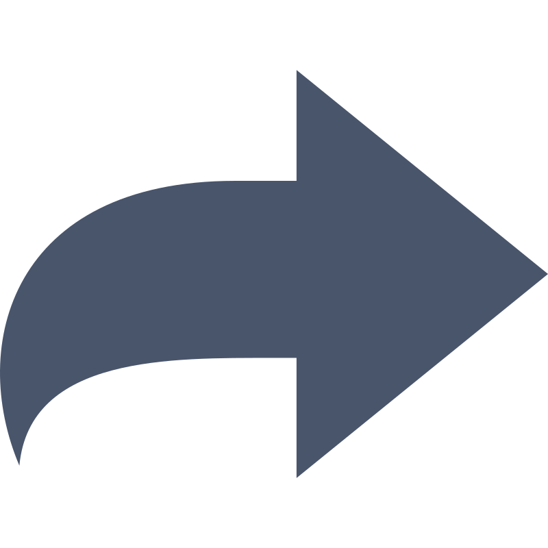

# Frontend Mentor - Article preview component solution

This is a solution to the [Article preview component challenge on Frontend Mentor](https://www.frontendmentor.io/challenges/article-preview-component-dYBN_pYFT). Frontend Mentor challenges help you improve your coding skills by building realistic projects. 

## Table of contents

- [Overview](#overview)
  - [The challenge](#the-challenge)
  - [Links](#links)
- [My process](#my-process)
  - [Built with](#built-with)
  - [What I learned](#what-i-learned)
  - [Continued development](#continued-development)
  - [AI Collaboration](#ai-collaboration)
- [Author](#author)

## Overview

### The challenge

Users should be able to:

- View the optimal layout for the component depending on their device's screen size
- See the social media share links when they click the share icon

### Links

- Solution URL: [https://www.frontendmentor.io/solutions/article-preview-component-with-vanilla-js-and-responsive-flex-9aJ2](https://www.frontendmentor.io/solutions/article-preview-component-with-vanilla-js-and-responsive-flex-9aJ2)
- Live Site URL: [https://bulsu-kdlantolin.github.io/article-preview-component/](https://bulsu-kdlantolin.github.io/article-preview-component/)

## My process

### Built with

- Semantic HTML5 markup
- CSS custom properties (Variables)
- Flexbox layout engine
- Mobile-first workflow
- Vanilla JavaScript for interactive state handling

### What I learned

During this challenge, I learned how to manage two entirely separate responsive states for a interactive component using a single JavaScript event handler function. By targeting individual DOM IDs for the author section, the mobile share container, and the desktop popup bubble, I used conditional window checks to toggle the visibility architecture depending on the exact viewport size:

```html
<!-- Separated visibility states structured into the markup -->
<div class="author-section" id="author-section">
  
  <div>
    <h2>Michelle Appleton</h2>
    <span>28 Jun 2020</span>
  </div>
  <button id="share-button">
            
  </button>
  <div class="share-popup hidden" id="share-popup">...</div>
</div>

<div class="share-section hidden" id="share-section">...</div>
```
```js
const handleShare = () => {
    if(window.innerWidth >= 768) {
        sharePopup.classList.toggle("hidden");
    } else {
        shareSection.classList.toggle("hidden");
        authorSection.classList.toggle("hidden");
    }
};

shareBtn.addEventListener('click', handleShare);
activeShareBtn.addEventListener('click', handleShare);
```

## Continued development
In upcoming projects, I want to keep refining how I build responsive states. I plan on finding ways to structure layout classes so that window resize events don't conflict with active DOM states, ensuring a completely stable experience across fluid screen transitions.

## AI Collaboration
Tools Used: Gemini

Usage Strategy: Assisted in refining CSS card padding, configuring absolute placement offsets for the desktop CSS triangle (::after pseudo-element), and debugging the maximum viewport constraints for phone mockups to prevent unwanted text stretching.

### Author
Frontend Mentor - @kiandavey